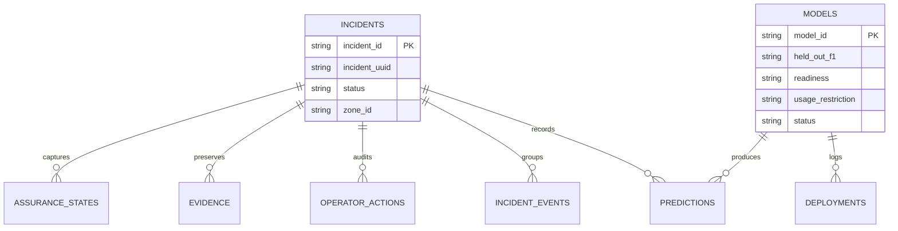

# Governed incident database

Phase 1 adds a separate, backward-compatible incident record beside the existing emergency-event and telemetry tables. `MigrationRunner` applies numbered migrations once through `schema_migrations`; it keeps the legacy tables and creates `LEGACY-*` incident records for prior emergency events. SQLite runs in WAL mode with foreign keys and a short busy timeout.

Inference code never waits for persistence: `SQLiteWriter` accepts operations on one bounded queue, retries transient locks, and records failures for health reporting. A queue failure does not change a detection or actuator decision.

`EvidenceExporter` creates `evidence/<incident_id>/manifest.json` and an optional ZIP. The manifest contains the incident timeline, predictions, operator actions, copied source files, and SHA-256 values. `verify()` recomputes every packaged-file hash before accepting it.

Synthetic profiles remain `RESEARCH_ONLY`; model entries carry the same usage restriction. Missing evaluation measures are stored as `UNVERIFIED`, never inferred. Startup checksum mismatches mark the model `REVIEW_REQUIRED` and record a deployment event.

## Phase 2 migration

Migration 3 adds isk_level and isk_breakdown_json to incidents. Migrations remain append-only; old data and tables are retained.
