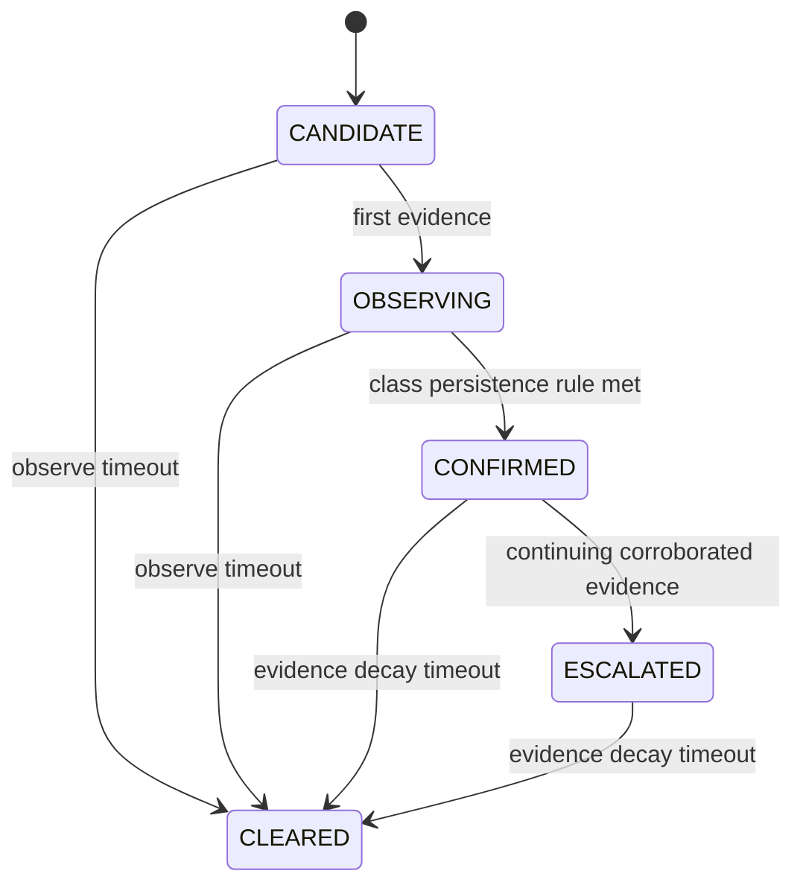

# Phase 2 decision logic

`ESCALATED` creates an operator-attention condition only. It never contacts emergency services automatically.

| OOD rule | Result reason code |
|---|---|
| low max-softmax or high entropy | `LOW_CONFIDENCE_OR_HIGH_ENTROPY` |
| low top-two margin | `LOW_TOP2_MARGIN` |
| vision/audio class disagreement | `MODALITY_CONFLICT` |
| dark, blurred, silent, or clipped input | `INPUT_QUALITY_FAILURE` |
| optional supplied energy score | `ENERGY_OOD` |

All confidence is explicitly `UNCALIBRATED` until held-out validation data supports calibration. Synthetic-model outputs keep the `RESEARCH_ONLY` restriction.

| Event | Road | Server room | Restricted area |
|---|---|---|---|
| smoke | HIGH | CRITICAL | HIGH |
| fire | HIGH | CRITICAL | CRITICAL |
| vehicle | MEDIUM | HIGH | HIGH |
| crash | CRITICAL | HIGH | HIGH |
| siren | MEDIUM | MEDIUM | HIGH |
| ambulance | HIGH | MEDIUM | HIGH |

Risk stores its factors, weights, contributions, score and selected level in the incident record. Unknown zones use the configured road fallback and include `UNKNOWN_ZONE_FALLBACK`.
