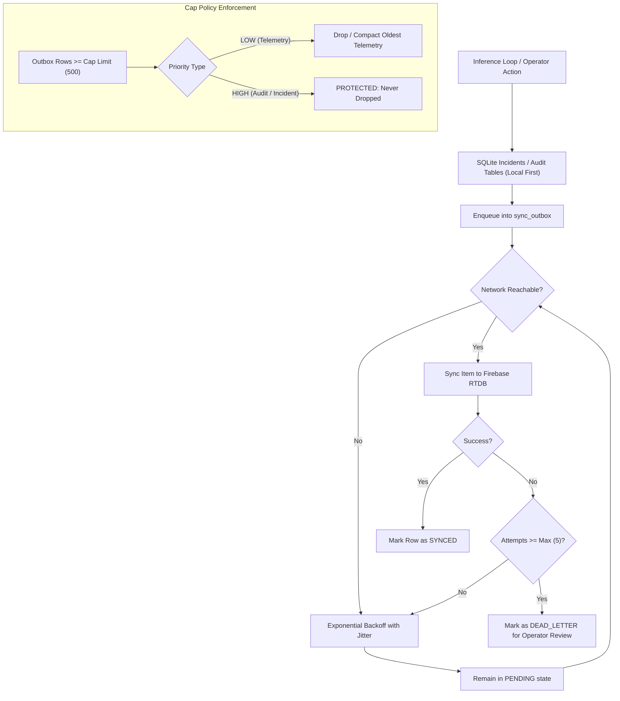

# SENTINEL-AI System Monitoring, Resilience & Streaming (Phase 4)

This document specifies the operational architecture for model drift monitoring (Feature 7), device hardware health and offline-first persistence (Feature 9), and multi-modal streaming services (Feature 10).

---

## 1. Subsystem Health States

The system monitors edge sensors, actuators, storage volumes, database writers, and external network bridges. Each subsystem evaluates its health periodically:

| Health State | Definition | Operational Behavior |
| :--- | :--- | :--- |
| **`OK`** | Subsystem is responding within calibrated latency thresholds. | Full operational capabilities enabled. |
| **`DEGRADED`** | Component is operational but impaired (e.g. storage below warn limit, queue depth high, audio clipping). | Alerts flagged in dashboard; failsafes active. |
| **`DOWN`** | Component failed, disconnected, or missing optional dependency. | Triggers assurance level downgrade; auto-reconnect initiates. |
| **`UNKNOWN`** | Subsystem status has not yet reported or is uninitialized. | Monitored until heartbeat timeout. |

Only **state transitions** are written to the `device_health_events` table in SQLite to preserve flash storage IOPS and provide availability metrics.

---

## 2. Assurance Levels & Graceful Degradation Matrix

The system dynamically derives an **Assurance Level** based on active physical and driver streams. Fused confidence and decision rules are adapted through the graceful degradation adapter in [`ZoneAwareRiskEngine`](file:///c:/Users/gokul/Desktop/PROJECTS/Edge-AI/src/modules/sensor_fusion/decision_logic.py):

| Assurance Level | Camera State | Microphone State | Sensor Hub State | Fused Confidence Multiplier | Operating Policy |
| :--- | :--- | :--- | :--- | :---: | :--- |
| **`FULL`** | `OK`/`DEGRADED` | `OK`/`DEGRADED` | `OK`/`DEGRADED` | **1.00** | Full optical, acoustic, and environmental multi-modal fusion. |
| **`VISION_ONLY`** | `OK`/`DEGRADED` | `DOWN` | `DOWN` | **0.75** | Acoustic corridor clearance disabled; optical tracking only. |
| **`AUDIO_ONLY`** | `DOWN` | `OK`/`DEGRADED` | `DOWN` | **0.75** | Video recording disabled; acoustic emergency vehicle / crash detection. |
| **`SENSORS_ONLY`**| `DOWN` | `DOWN` | `OK`/`DEGRADED` | **0.65** | Rely on IMU shock, gas ppm spikes, and temperature telemetry. |
| **`DEGRADED`** | *Partial* | *Partial* | *Partial* | **0.80** | Fallback mode; human operator confirmation required for critical acts. |

No single driver or stream failure crashes the inference loop or SQLite persistence.

---

## 3. Model Drift Monitoring (Feature 7)

Model drift calculations compare rolling-window prediction streams against recorded baselines stored in `model_baselines`.

### Metrics & Thresholds

| Metric | Formulation / Calculation | Watch Threshold | Warning Threshold | Review Required |
| :--- | :--- | :---: | :---: | :---: |
| **Population Stability Index (PSI)** | $\text{PSI} = \sum (A_i - E_i) \times \ln(A_i / E_i)$ | $\ge 0.10$ | $\ge 0.25$ | — |
| **Class Prior Shift** | $\max_k |P_{\text{live}}(k) - P_{\text{base}}(k)|$ | $\ge 0.20$ | $\ge 0.30$ | — |
| **Out-Of-Distribution (OOD) Rate** | Ratio of predictions flagged with OOD reasons | $\ge 0.10$ | $\ge 0.20$ | — |
| **False-Alarm Rate** | 24-hr closed incidents labeled `FALSE_ALARM` | $\ge 0.08$ | $\ge 0.15$ | — |
| **Operator Disagreement Rate**| `INCORRECT` labels / total reviewed feedback | $\ge 0.20$ | $\ge 0.30$ | $\ge 0.35$ |

### Guardrails & Safety Policy
1. **Minimum-Sample Guard:** If rolling window has $< 10$ samples, `insufficient_data=true` is set. The status **never exceeds `WATCH`**.
2. **Synthetic Restriction:** Baselines created from simulated datasets carry `source='synthetic'` and `usage_restriction='RESEARCH_ONLY'`.
3. **No Auto-Swap Guard:** Models with status `REVIEW_REQUIRED` raise alerts and mark model registry records for operator attention, but **never automatically swap or deactivate models**.

---

## 4. Offline-First Sync Outbox Architecture

All edge inferences, incident creation, and operator audit entries are written synchronously to SQLite first. Cloud sync to Firebase is asynchronous and handled by [`OfflineSyncOutbox`](file:///c:/Users/gokul/Desktop/PROJECTS/Edge-AI/src/modules/assurance/device_health.py).

---

## 5. Streaming Services (Feature 10)

- **`CameraService`**: Bounded latest-frame-wins buffer (`buffer_max=2`). Older frames are dropped without growing heap queues. Supports USB webcam indices, RTSP feeds, and simulation mock files.
- **`AudioService`**: Ring buffer generating fixed overlapping windows (`window_samples`, `hop_samples`) fed into `EdgeAcousticNet`. Tracks audio clipping ($>0.98$) and silence RMS ($<0.005$).
- **Optional Imports**: When `cv2` or `pyaudio` are unavailable, stream services report `DOWN` with reason code `dependency_missing` while simulation sources remain fully operational.
