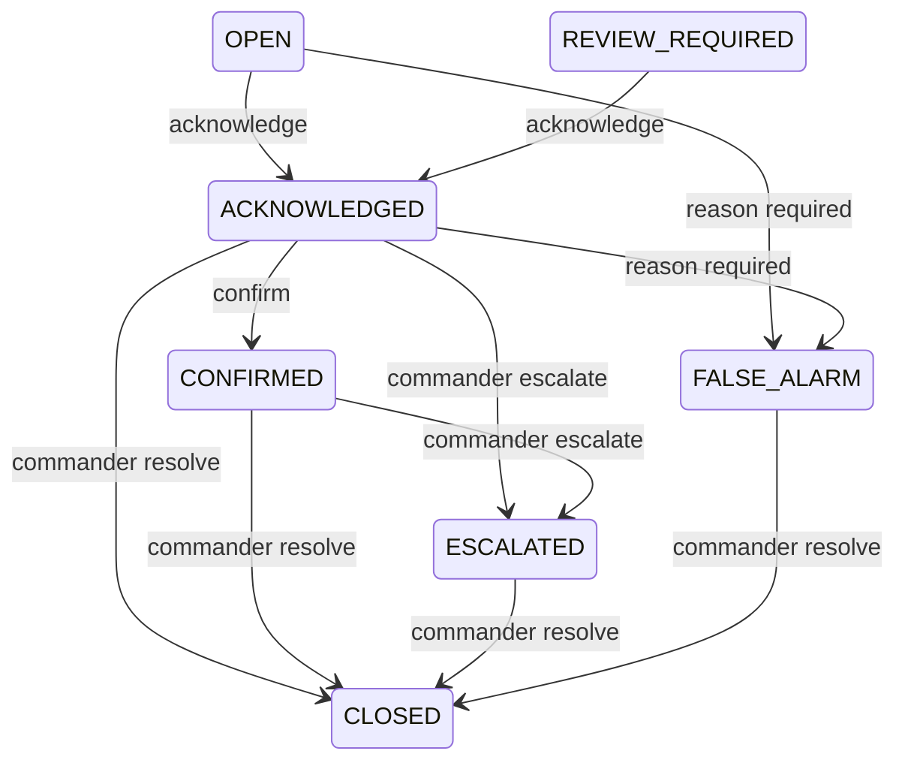

# Operator workflow

The dashboard keeps emergency decisions under human control. `ESCALATED` means ready for operator attention; external dispatch is simulated and requires an authenticated Commander action.



Every transition includes the operator, role, timestamp, previous and new state, and reason. Version checks reject duplicate or stale requests. Closed incidents accept appended notes but no further state changes.

| Capability | Commander | Operator | Engineer | Viewer |
|---|---:|---:|---:|---:|
| View incidents and plans | Yes | Yes | Yes | Yes |
| Acknowledge / confirm | Yes | Yes | No | No |
| Mark false alarm / add note | Yes | Yes | No | No |
| Escalate / resolve | Yes | No | No | No |
| Review queue and model registry | Yes | Yes | Yes | No |
| Stream Controls (Camera / Audio Start / Stop) | Yes | Yes | No (View only) | No |
| View System Health & Drift Dashboard | Yes | Yes | Yes | Yes |
| View Operations Analytics & Historical Trends | Yes | Yes | Yes | Yes |

The Review Queue prioritizes unknown, OOD-flagged, low-confidence, and disputed predictions. Reviewers claim an item before adding `CORRECT`, `INCORRECT`, or `UNSURE` feedback. Changed feedback creates another row, preserving history. JSON and CSV manifests include only reviewed feedback and exclude demo incidents by default. Export never starts training.

The Emergency Plan is available at `#emergency-plan`. Browser back, forward, and reload preserve the current page. The Incident Logs page lists governed incidents and opens a detail panel containing temporal events, stored risk, OOD state, evidence, and the append-only audit trail.

The System Health & Resilience page is available at `#system-health`. It provides real-time visibility into subsystem availability, live camera/audio stream parameters and controls, model drift stability indices (PSI), and the offline-first sync outbox queue.

The Operations Analytics & Intelligence page is available at `#analytics`. It provides:
- **Operations Overview**: Executive KPI cards tracking total incident volume, active vs resolved counts, MTTA (Mean Time to Acknowledge), MTTR (Mean Time to Resolve), False Alarm Rate (FAR), and overall subsystem uptime.
- **Incident Volume Trends**: Visual time-series charts (hourly/daily) tracking volume by severity (Critical, High, Medium, Low) and false-alarm frequency.
- **Zone Risk Comparison**: Spatial density and exposure ratings per urban corridor zone (`CRITICAL`, `HIGH`, `MEDIUM`, `LOW`).
- **Model Performance & Drift**: Mean confidence calibration, Out-of-Distribution (OOD) frequency, operator disagreement rates from feedback, confusion matrix, and PSI drift progression timelines.
- **Device Availability Timeline**: Subsystem component availability progress bars and transition logs.
- **Offline-Sync Backlog**: Idempotent replay outbox history, pending sync tallies, retry counts, and dead-letter records.
- **Global Filters & Deep Linking**: Date range, zone, severity, target model, and demo toggles persist directly in URL query strings (e.g. `#analytics?range=7d&zone=ZONE_B_INTERSECTION&severity=CRITICAL`) for shareable situational state.
- **Offline & Edge-Optimized**: Powered by a locally bundled offline charting engine (`chart.min.js`, zero CDN dependencies) with read-only non-blocking queries and short in-memory response caching to protect Raspberry Pi CPU.

## Reporting and Exports

Sentinel-AI includes a comprehensive, audit-logged reporting and export suite. All generated reports are saved with cryptographic SHA-256 digests in `reports/` and tracked in `reports/manifest.json`. Every generation and download action is permanently recorded in the `operator_actions` audit ledger.

### Role Permissions for Reports & Exports

| Report / Export Type | Commander | Operator | Engineer | Viewer |
|---|---:|---:|---:|---:|
| Incident CSV Export (Streamed, Injection-Safe) | Yes | Yes | No | No |
| Monthly Operations Report (`monthly`) | Yes | Yes | No | No |
| Model Assurance & Verification Report (`assurance`) | Yes | No | Yes | No |
| Model Drift Monitoring Report (`drift`) | Yes | No | Yes | No |
| Device Health & Availability Report (`health`) | Yes | No | Yes | No |
| Evidence Package Index (`evidence`) | Yes | Yes | Yes | No |
| Forensic Evidence Hash Verification (`verify-evidence`) | Yes | Yes | Yes | No |

### CLI Usage

Generate reports directly from the command line:
```bash
# Generate monthly operations report (HTML + PDF if ReportLab installed)
python -m src.modules.reporting generate --type monthly --month 2026-10 --role COMMANDER

# Generate model assurance report
python -m src.modules.reporting generate --type assurance --role ENGINEER

# Generate model drift report
python -m src.modules.reporting generate --type drift --role ENGINEER

# Generate device health report
python -m src.modules.reporting generate --type health --role ENGINEER

# Generate forensic evidence package index
python -m src.modules.reporting generate --type evidence --role COMMANDER

# Export incidents to sanitized CSV
python -m src.modules.reporting export-csv --out reports/incidents_export.csv --role OPERATOR

# Re-hash all evidence files and verify integrity against SQLite ledger
python -m src.modules.reporting verify-evidence
```

### Forensic Evidence Verification
The verification engine re-hashes all physical evidence files (keyframes, audio clips, sensor traces) on disk using SHA-256 and compares them with the immutable records stored in the SQLite ledger. Any missing or tampered file is immediately flagged with its expected vs. actual digest and logged to the audit trail.

## Data Retention and Storage Safety (Phase 5D)

To ensure unattended 24/7 reliability on the Raspberry Pi 4, Sentinel-AI enforces automated retention limits, storage safety margins, and database maintenance routines.

### Retention Policies & Safeguards

| Subsystem | Policy Limit | Eviction / Retention Mechanism | Safeguard |
|---|---|---|---|
| **Raw Telemetry** | 3 days raw / 7 days max | Automatically compressed to `.json.gz` archives in `data/archives/` before raw rows are pruned from SQLite. | Archive SHA-256 is verified before pruning. |
| **Blackbox DVR** | 500 MB hard cap | Oldest video recordings are evicted first when the directory exceeds the storage cap. | Newest pre/post-crash emergency clips are retained. |
| **Forensic Evidence** | 30 days | Files older than 30 days are pruned only if the linked incident is `CLOSED` or `RESOLVED`. | **NEVER deletes active incidents or evidence linked to open incidents.** |
| **Audit Ledger** | Indefinite | Permanent immutable history. | **NEVER deleted under any circumstances.** |
| **Offline Sync Outbox** | 500 rows max | Expired `SYNCED` rows pruned after 7 days. Low-priority telemetry dropped if cap exceeded. | **NEVER drops `HIGH`, `AUDIT`, or unsynced (`PENDING`/`DEAD_LETTER`) rows.** |
| **SQLite WAL** | 10 MB threshold | Automatic `TRUNCATE` checkpoints to reclaim flash storage space. | Passive checkpoints flush pages with zero database locks. |

### Storage CLI Commands

```bash
# View storage health, volume utilization, and threshold margins
python -m src.modules.storage status

# Run safe retention cleanup in dry-run mode (simulate without deletion)
python -m src.modules.storage cleanup --dry-run --policy all --role COMMANDER

# Execute real storage cleanup (Commander or Engineer role required)
python -m src.modules.storage cleanup --policy all --role COMMANDER

# Force a WAL checkpoint (PASSIVE or TRUNCATE)
python -m src.modules.storage checkpoint --mode TRUNCATE --role ENGINEER

# View immutable history of storage cleanup actions
python -m src.modules.storage logs --limit 10
```

