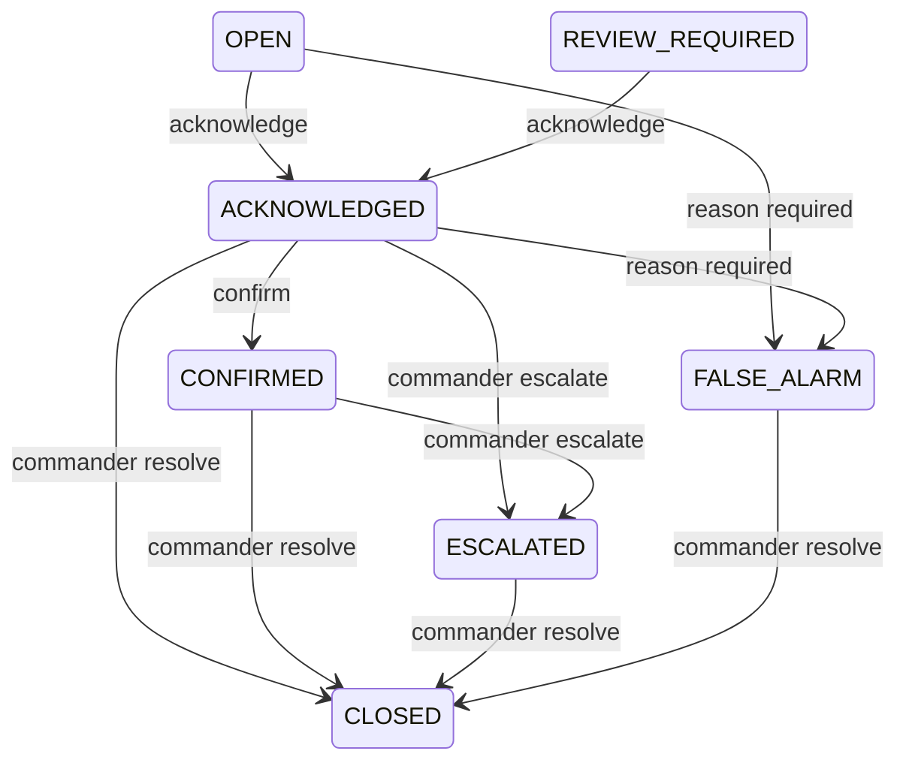

# Operator workflow

The dashboard keeps emergency decisions under human control. `ESCALATED` means ready for operator attention; external dispatch is simulated and requires an authenticated Commander action.

Every transition includes the operator, role, timestamp, previous and new state, and reason. Version checks reject duplicate or stale requests. Closed incidents accept appended notes but no further state changes.

| Capability | Commander | Operator | Engineer | Viewer |
|---|---:|---:|---:|---:|
| View incidents and plans | Yes | Yes | Yes | Yes |
| Acknowledge / confirm | Yes | Yes | No | No |
| Mark false alarm / add note | Yes | Yes | No | No |
| Escalate / resolve | Yes | No | No | No |
| Review queue and model registry | Yes | Yes | Yes | No |
| Stream Controls (Camera / Audio Start / Stop) | Yes | Yes | No (View only) | No |
| View System Health & Drift Dashboard | Yes | Yes | Yes | Yes |
| View Operations Analytics & Historical Trends | Yes | Yes | Yes | Yes |

The Review Queue prioritizes unknown, OOD-flagged, low-confidence, and disputed predictions. Reviewers claim an item before adding `CORRECT`, `INCORRECT`, or `UNSURE` feedback. Changed feedback creates another row, preserving history. JSON and CSV manifests include only reviewed feedback and exclude demo incidents by default. Export never starts training.

The Emergency Plan is available at `#emergency-plan`. Browser back, forward, and reload preserve the current page. The Incident Logs page lists governed incidents and opens a detail panel containing temporal events, stored risk, OOD state, evidence, and the append-only audit trail.

The System Health & Resilience page is available at `#system-health`. It provides real-time visibility into subsystem availability, live camera/audio stream parameters and controls, model drift stability indices (PSI), and the offline-first sync outbox queue.

The Operations Analytics & Intelligence page is available at `#analytics`. It provides:
- **Operations Overview**: Executive KPI cards tracking total incident volume, active vs resolved counts, MTTA (Mean Time to Acknowledge), MTTR (Mean Time to Resolve), False Alarm Rate (FAR), and overall subsystem uptime.
- **Incident Volume Trends**: Visual time-series charts (hourly/daily) tracking volume by severity (Critical, High, Medium, Low) and false-alarm frequency.
- **Zone Risk Comparison**: Spatial density and exposure ratings per urban corridor zone (`CRITICAL`, `HIGH`, `MEDIUM`, `LOW`).
- **Model Performance & Drift**: Mean confidence calibration, Out-of-Distribution (OOD) frequency, operator disagreement rates from feedback, confusion matrix, and PSI drift progression timelines.
- **Device Availability Timeline**: Subsystem component availability progress bars and transition logs.
- **Offline-Sync Backlog**: Idempotent replay outbox history, pending sync tallies, retry counts, and dead-letter records.
- **Global Filters & Deep Linking**: Date range, zone, severity, target model, and demo toggles persist directly in URL query strings (e.g. `#analytics?range=7d&zone=ZONE_B_INTERSECTION&severity=CRITICAL`) for shareable situational state.
- **Offline & Edge-Optimized**: Powered by a locally bundled offline charting engine (`chart.min.js`, zero CDN dependencies) with read-only non-blocking queries and short in-memory response caching to protect Raspberry Pi CPU.
